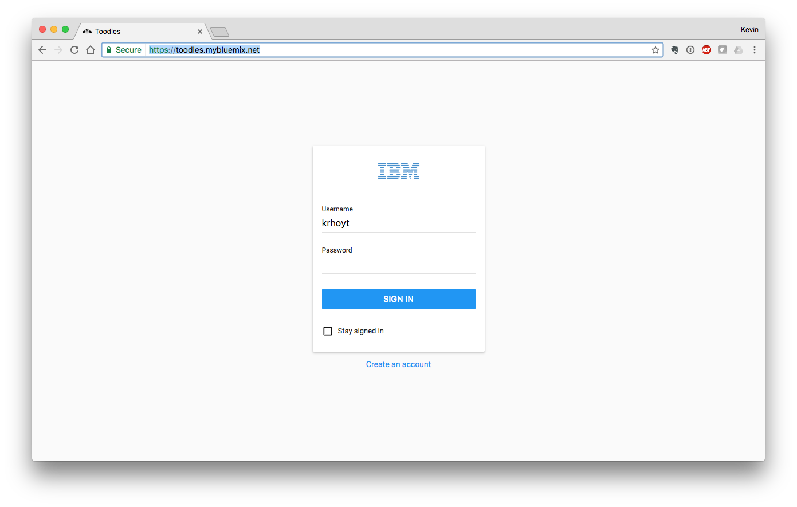
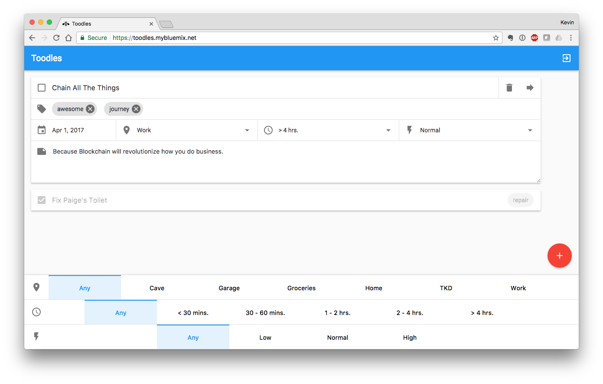

#  Implementing Common Transactions on IBM Blockchain - Hyperledger Fabric V1

This project is focused on helping a developer to migrate from Hyperledger Fabric V.6 to V1. It shows how to perform traditional data store transactions on IBM Blockchain. This surfaces as a web-based, to-do list application, allowing browse, read, edit, add, and delete (BREAD) operations.


The to-do list application presented here is designed to help developers understand how common transactions needed by business processes can be adapted to use Blockchain. Blockchain != Bitcoin. It might be said that Bitcoin is the first Blockchain application. As a distributed ledger, the distinct characteristics such as decentralization, consensus, and encryption have broad-reaching implications to many business verticals including finance, transportation, health care, and others.

## Application Communication Workflow


* User will interact with the Todos client application, in their browser.
* When the user performs any action, the client application calls the server application API where the registered admin interacts with the Hyperledger Blockchain Network.
* Reading or writing the ledger is known as a proposal. This proposal is built by Todos Server (via the SDK) and then sent to a blockchain peer.
* The peer will communicate to its Todos chaincode container. The chaincode will run/simulate the transaction. If there are no issues it will endorse the transaction and send it back to our Todos application.
* Todos (via the SDK) will then send the endorsed proposal to the ordering service. The orderer will package many proposals from the whole network into a block. Then it will broadcast the new block to peers in the network.
* Finally the peer will validate the block and write it to its ledger. The transaction has now taken effect and any subsequent reads will reflect this change.

## Prerequisite

* [Go](https://golang.org/) - most recent version
* [Docker](https://www.docker.com/products/overview) - v1.13 or higher
* [Docker Compose](https://docs.docker.com/compose/overview/) - v1.8 or higher
* [Node.js & npm](https://nodejs.org/en/download/) - node v6.2.0 - v6.10.0 (v7+ not supported); npm comes with your node installation.
* [xcode](https://developer.apple.com/xcode/) - only required for OS X users
* [nvm](https://github.com/creationix/nvm/blob/master/README.markdown) - if you want to use the nvm install command to retrieve a node version


## Steps

1. [Download the docker images and get the code for hyperledger fabric V1 node sdk](#1-download-the-docker-images-and-get-the-code-for-hyperledger-fabric-v1-node-sdk)
2. [Edit the configuration](#2-edit-the-configuration)
3. [Start your network](#3-start-your-network)
4. [Use the Node SDK](#4-use-the-node-sdk)
5. [Run the todo list fabric server](#5-run-the-todo-list-fabric-server)
6. [Run the todo list fabric client](#6-run-the-todo-list-fabric-client)
7. [Using the todo list application](#7-run-the-todo-list-application)

# 1. Download the docker images and get the code for hyperledger fabric V1 node sdk

`download-dockerimages.sh` contains the code for downloading the docker images required to setup the network for running Hyperledger Fabric V1.

From your workspace, make the shell script an executable:

```bash
chmod +x download-dockerimages.sh
```

Now run the script. Make sure you have docker running before executing this script. This process will take a few minutes so be patient:

```bash
./download-dockerimages.sh
```

Once the script has completed, you should see the following in your terminal:

```bash
===> List out hyperledger docker images
hyperledger/fabric-ca          latest               35311d8617b4        3 weeks ago         240 MB
hyperledger/fabric-ca          x86_64-1.0.0-alpha   35311d8617b4        3 weeks ago         240 MB
hyperledger/fabric-couchdb     latest               f3ce31e25872        3 weeks ago         1.51 GB
hyperledger/fabric-couchdb     x86_64-1.0.0-alpha   f3ce31e25872        3 weeks ago         1.51 GB
hyperledger/fabric-kafka       latest               589dad0b93fc        3 weeks ago         1.3 GB
hyperledger/fabric-kafka       x86_64-1.0.0-alpha   589dad0b93fc        3 weeks ago         1.3 GB
hyperledger/fabric-zookeeper   latest               9a51f5be29c1        3 weeks ago         1.31 GB
hyperledger/fabric-zookeeper   x86_64-1.0.0-alpha   9a51f5be29c1        3 weeks ago         1.31 GB
hyperledger/fabric-orderer     latest               5685fd77ab7c        3 weeks ago         182 MB
hyperledger/fabric-orderer     x86_64-1.0.0-alpha   5685fd77ab7c        3 weeks ago         182 MB
hyperledger/fabric-peer        latest               784c5d41ac1d        3 weeks ago         184 MB
hyperledger/fabric-peer        x86_64-1.0.0-alpha   784c5d41ac1d        3 weeks ago         184 MB
hyperledger/fabric-javaenv     latest               a08f85d8f0a9        3 weeks ago         1.42 GB
hyperledger/fabric-javaenv     x86_64-1.0.0-alpha   a08f85d8f0a9        3 weeks ago         1.42 GB
hyperledger/fabric-ccenv       latest               91792014b61f        3 weeks ago         1.29 GB
hyperledger/fabric-ccenv       x86_64-1.0.0-alpha   91792014b61f        3 weeks ago         1.29 GB
```

Clone the repo for fabric node sdk:
```bash
git clone https://github.com/hyperledger/fabric-sdk-node.git
```

First, checkout the alpha branch of the `fabric-sdk-node` repository:
```bash
cd fabric-sdk-node
git checkout v1.0.0-alpha
```

Ensure that you are on the correct branch:
```bash
git branch
```

You should see the following:
```bash
Ishans-MacBook-Pro:fabric-sdk-node ishan$ git branch
* (HEAD detached at v1.0.0-alpha)
  master
```

Now hop back to your workspace directory:
```bash
cd ..
```

From your workspace, move the docker-compose-networksetup.yaml to the test/fixtures folder in the fabric-sdk-node directory:

```bash
mv docker-compose-networksetup.yaml fabric-sdk-node/test/fixtures
```

Still from your workspace, empty the example chaincode source from the fabric-sdk-node directory:

```bash
rm -rf fabric-sdk-node/test/fixtures/src/github.com/example_cc/*
```

Now copy the todo list chaincode to the same folder:
```bash
cp todo-list-fabric-server/chaincode/* fabric-sdk-node/test/fixtures/src/github.com/example_cc/
```
> **Note:** If you want to run your own code on hyperledger fabric V1, just copy the chaincode code in fabric-sdk-node/test/fixtures/src/github.com/example_cc directory.

# 2. Edit the configuration

Update the `config.json` and `instantiate-chaincode.js` files in the fabric-sdk-node directory:

```bash
cd fabric-sdk-node/test/integration/e2e
```

Use an editor to open the `config.json` and replace all instances of `grpcs` with `grpc`.

Use an editor to open `instantiate-chaincode.js` and replace line 147 with:
```bash
args: ['init'],
```

# 3. Start your network

`docker-compose-networksetup.yaml` contains the configuration to setup the network.

Navigate to the test/fixtures folder in the fabric-sdk-node directory and run the docker-compose file:

```bash
cd fabric-sdk-node/test/fixtures
docker-compose -f docker-compose-networksetup.yaml up -d
```

Once complete, issue a docker ps command to view your currently running containers. You should see the following:
```bash
CONTAINER ID        IMAGE                        COMMAND                  CREATED             STATUS                       PORTS                                            NAMES
e61cf829f171        hyperledger/fabric-peer      "peer node start -..."   3 minutes ago       Up 2 minutes           0.0.0.0:7056->7051/tcp, 0.0.0.0:7058->7053/tcp   peer1
0cc1f5ac24da        hyperledger/fabric-peer      "peer node start -..."   3 minutes ago       Up 2 minutes        0.0.0.0:8056->7051/tcp, 0.0.0.0:8058->7053/tcp   peer3
7ab3106e5076        hyperledger/fabric-peer      "peer node start -..."   3 minutes ago       Up 3 minutes        0.0.0.0:7051->7051/tcp, 0.0.0.0:7053->7053/tcp   peer0
2bc5c6606e6c        hyperledger/fabric-peer      "peer node start -..."   3 minutes ago       Up 3 minutes        0.0.0.0:8051->7051/tcp, 0.0.0.0:8053->7053/tcp   peer2
513be1b46467        hyperledger/fabric-ca        "sh -c 'fabric-ca-..."   3 minutes ago       Up 3 minutes        0.0.0.0:8054->7054/tcp                           ca_peerOrg2
741c363ba34a        hyperledger/fabric-orderer   "orderer"                3 minutes ago       Up 3 minutes        0.0.0.0:7050->7050/tcp                           orderer0
abaae883eb13        couchdb                      "tini -- /docker-e..."   3 minutes ago       Up 3 minutes        0.0.0.0:5984->5984/tcp                           couchdb
2c2d51fe88c0        hyperledger/fabric-ca        "sh -c 'fabric-ca-..."   3 minutes ago       Up 3 minutes        0.0.0.0:7054->7054/tcp                           ca_peerOrg1

```

# 4. Use the Node SDK

Go back to the root of the `fabric-sdk-node` directory and add grpc dependency `"grpc": "1.1.2"` to package.json

Install node modules in your SDK repo.
```bash
npm install
npm install -g gulp
# if you get a "permission denied" error, then try with sudo
sudo npm install -g gulp
```
Finally, build the fabric-ca client:
```bash
gulp ca
```

Remove the key value stores and hfc artifacts that may have cached during previous runs:
```bash
rm -rf /tmp/hfc-*
rm -rf ~/.hfc-key-store
```

Update the chaincode version from v0 to v1 in `util.js` present in `test/unit`
```bash
module.exports.END2END = {
	channel: 'mychannel',
	chaincodeId: 'end2end',
	chaincodeVersion: 'v1'
};
```

### Create channel

A Hyperledger Fabric channel is a private “subnet” of communication between two or more specific network members, for the purpose of conducting private and confidential transactions. A channel is defined by members (organizations), anchor peers per member, the shared ledger, chaincode application(s) and the ordering service node(s). Each transaction on the network is executed on a channel, where each party must be authenticated and authorized to transact on that channel. Each peer that joins a channel, has its own identity given by a membership services provider (MSP), which authenticates each peer to its channel peers and services.

Now, leverage the SDK test program to create a channel named `mychannel`. From the `fabric-sdk-node` directory:
```bash
node test/integration/e2e/create-channel.js
```

### Join channel
Pass the genesis block - `mychannel.block` - to the ordering service and join the peers to your channel:
```bash
node test/integration/e2e/join-channel.js
```

### Install chaincode
Install the todo list source code on the peer's filesystems:
```bash
node test/integration/e2e/install-chaincode.js
```

### Instantiate chaincode
Spin up the todo list containers:
```bash
node test/integration/e2e/instantiate-chaincode.js
```

# 5. Run the todo list fabric server

Navigate to the root of the `todo-list-fabric-server` directory.

Install node modules in your fabric server repo.
```bash
npm install
```

Run the server:
```bash
node server.js
```

Issue a get request to `/enrollAdmin` endpoint, to the Enroll the admin on chaincode:

You should see the following response:
```
{
  "message": "Admin Enrolled! "
}
```
# 6. Run the todo list fabric client

In a new terminal, navigate to the root of the `todo-list-fabric-client/web` directory.

In order for the web-based to-do list application to work, it must be run from a web server. This server does not need to be publicly available in order for the application to function.

On Mac, a common approach is to use the built-in PHP installation to run an in-place web server.
Run the PHP web server:
```bash
php -S localhost:8081
```

On windows, you can use [XAMPP](https://www.apachefriends.org/index.html)
# 7. Using the todo list application

Use the link `http://localhost:8081` to load the web application in browser. You will be presented with a login screen. The login dialog contains an IBM logo. Alt+Click on that logo to preload data into the blockchain. The only indication that this operation has been completed is a transaction ID in the developer console.

> While not extremely verbose, transaction IDs from IBM Blockchain are presented in the developer console of the browser for every change made at the blockchain itself. It may be useful to have the developer console open when you are using the to-do list application.



There are three accounts created in the default data. In the form of username:password, those accounts are ...

- krhoyt:abc123
- abtin:abc123
- peter:abc123

You can login with any of these accounts to browse, read, edit, add, and delete to-do items.



- To create a to-do list item, click on the red button labeled "+". Hovering over this button will present the additional button to create a "location".
- To edit a to-do list item, click on the item you are interested in editing and modify the fields to match your desired values. There is no "save" button as all changes are immediately committed to the blockchain.
- To delete a to-do list item, move your mouse over any item, and click on the trash can icon.
- To forward the to-do list item to another person, move your mouse over any item and click on the arrow icon that appears. A list of other users in the system will be presented. Select a name.
- To logout of the application, click the icon that is a box with an arrow inside of it. This is located in the upper-righthand corner of the screen.
- Using the above account information, log into the application again using a different account to see to-do items forwarded on to other users in the system.

# Additional resources
Following is a list of additional blockchain resources:
* [Fundamentals of IBM Blockchain](https://www.ibm.com/blockchain/what-is-blockchain.html)
* [Hyperledger Fabric Documentation](http://fabric-rtd.readthedocs.io/en/latest/getting_started.html)
* [Hyperledger Fabric code on GitHub](https://github.com/hyperledger/fabric)
* [Hyperledger Fabric Composer](https://hyperledger.github.io/composer/)
* [How to migrate your Fabric v0.6-based chaincode to run on the latest Fabric v1.0](https://developer.ibm.com/blockchain/2017/03/17/migrate-fabric-v0-6-based-chaincode-run-latest-fabric-v1-0/)

# Troubleshooting

* If you see a `containerID already exists` upon running docker-compose up, then you need to remove the existing container. This command will remove all containers; NOT your images:
```bash
docker rm -f $(docker ps -aq)
```

* When running `create-channel.js`, if you see an error stating `private key not found`, then try clearing your cached key value stores:
```bash
rm -rf /tmp/hfc-*
rm -rf ~/.hfc-key-store
```

* The developer console in the browser is your key to troubleshooting any problems that may arise while running the client application. The first place to look for errors is in checking the values of the chaincode ID and url in the "/web/script/blockchain.js" file.

# References
* This example is based on to-do list application using Hyperledger Fabric V0.6 [Hyperledger Fabric V0.6](https://github.com/IBM/todo-list-fabric).

# License
[Apache 2.0](LICENSE)
